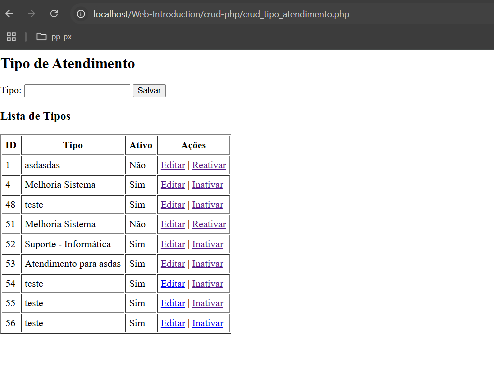
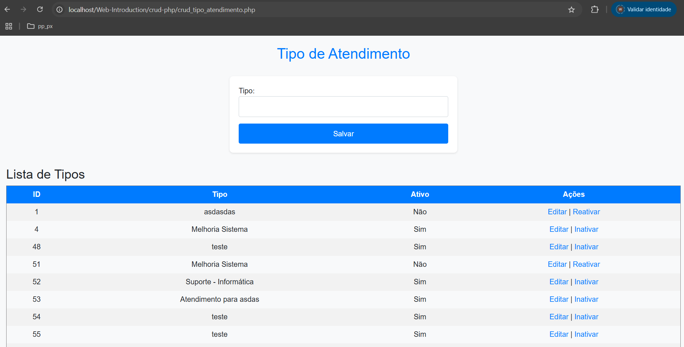

# CRUD Simple PHP

O objetivo deste repositório e mostrar de forma simples o funcionamento de um crud para a disciplina de aplicação web

## O que é CRUD

---
🧠 O que é um CRUD?
CRUD é uma sigla que representa as quatro operações básicas que a maioria dos sistemas faz com dados:

| Letra | Significado | O que faz   | Exemplo                    |
|-------|-------------|-------------|----------------------------|
| **C** | Create      | Criar       | Cadastrar um novo usuário  |
| **R** | Read        | Ler         | Mostrar a lista de usuários|
| **U** | Update      | Atualizar   | Editar o nome de um usuário|
| **D** | Delete      | Deletar     | Excluir um usuário da lista|


📦 Onde usamos o CRUD?
Quase todo sistema que trabalha com dados tem um CRUD por trás. Por exemplo:
- Um site de cadastro de alunos
- Uma lista de tarefas (to-do list)
- Um sistema de vendas

🛠 Como funciona o CRUD com PHP?

- Quando você faz um sistema simples com PHP e um banco de dados (como MySQL), o CRUD acontece assim:
- Create: você envia um formulário para cadastrar algo → o PHP pega os dados e salva no banco.
- Read: o PHP busca os dados no banco e mostra na tela.
- Update: o usuário clica em "editar" → o PHP mostra os dados no formulário → o usuário altera e envia → o PHP atualiza no banco.
- Delete: o usuário clica em "excluir" → o PHP apaga do banco (Neste ponto, vamos inativar, delete lógico).

---

## 1 - Banco de dados - Tipo de atendimento

---
Para este crud, vamos usar um banco de dados simples, com a seguinte tabela:

```sql
CREATE SCHEMA IF NOT EXISTS ratendimento DEFAULT CHARACTER SET utf8 ;
USE ratendimento;

CREATE TABLE tipo_atendimento (
    id_tipo_atendimento INT NOT NULL PRIMARY KEY AUTO_INCREMENT,
    tipo_atendimento VARCHAR(45) NOT NULL,
	ativo VARCHAR(1) NOT NULL
);

insert into tipo_atendimento values (1, 'CONSULTA', 'A');
select * from tipo_atendimento;
```
---

## 2 Código completo de um cadastro


Abaixo mostramos o código completo de um crud simples feito em php e sem css. Ao final da sessão vamos ter a explicação do que cada detalhe deste código faz, ficando facil de aplicar.

---

```php
<?php
// Conexão com o banco
$pdo = new PDO('mysql:host=localhost;dbname=ratendimento', 'root', '');

// Criar tabela se não existir
$pdo->exec("CREATE TABLE IF NOT EXISTS tipo_atendimento (
    id_tipo_atendimento INT NOT NULL PRIMARY KEY AUTO_INCREMENT,
    tipo_atendimento VARCHAR(45) NOT NULL,
    ativo VARCHAR(1) NOT NULL DEFAULT 'S'
)");

// Processar ações
$acao = $_GET['acao'] ?? '';
$id = $_GET['id'] ?? '';

if ($acao === 'salvar') {
    $tipo = $_POST['tipo_atendimento'];
    $id_editar = $_POST['id'] ?? '';

    if ($id_editar) {
        $stmt = $pdo->prepare("UPDATE tipo_atendimento SET tipo_atendimento = ? WHERE id_tipo_atendimento = ?");
        $stmt->execute([$tipo, $id_editar]);
    } else {
        $stmt = $pdo->prepare("INSERT INTO tipo_atendimento (tipo_atendimento, ativo) VALUES (?, 'S')");
        $stmt->execute([$tipo]);
    }
    header('Location: crud_tipo_atendimento.php');
    exit;
}

if ($acao === 'editar' && $id) {
    $stmt = $pdo->prepare("SELECT * FROM tipo_atendimento WHERE id_tipo_atendimento = ?");
    $stmt->execute([$id]);
    $registro = $stmt->fetch();
}

if ($acao === 'inativar' && $id) {
    $stmt = $pdo->prepare("UPDATE tipo_atendimento SET ativo = 'N' WHERE id_tipo_atendimento = ?");
    $stmt->execute([$id]);
    header('Location: crud_tipo_atendimento.php');
    exit;
}

if ($acao === 'reativar' && $id) {
    $stmt = $pdo->prepare("UPDATE tipo_atendimento SET ativo = 'S' WHERE id_tipo_atendimento = ?");
    $stmt->execute([$id]);
    header('Location: crud_tipo_atendimento.php');
    exit;
}

// Listar tudo
$stmt = $pdo->query("SELECT * FROM tipo_atendimento");
$tipos = $stmt->fetchAll();
?>

<h2>Tipo de Atendimento</h2>
<form method="POST" action="?acao=salvar">
    <input type="hidden" name="id" value="<?= $registro['id_tipo_atendimento'] ?? '' ?>">
    <label>Tipo:</label>
    <input type="text" name="tipo_atendimento" value="<?= $registro['tipo_atendimento'] ?? '' ?>" required>
    <button type="submit">Salvar</button>
</form>

<h3>Lista de Tipos</h3>
<table border="1" cellpadding="5">
    <tr>
        <th>ID</th>
        <th>Tipo</th>
        <th>Ativo</th>
        <th>Ações</th>
    </tr>
    <?php foreach ($tipos as $tipo): ?>
    <tr>
        <td><?= $tipo['id_tipo_atendimento'] ?></td>
        <td><?= $tipo['tipo_atendimento'] ?></td>
        <td><?= $tipo['ativo'] === 'S' ? 'Sim' : 'Não' ?></td>
        <td>
            <a href="?acao=editar&id=<?= $tipo['id_tipo_atendimento'] ?>">Editar</a> |
            <?php if ($tipo['ativo'] === 'S'): ?>
                <a href="?acao=inativar&id=<?= $tipo['id_tipo_atendimento'] ?>">Inativar</a>
            <?php else: ?>
                <a href="?acao=reativar&id=<?= $tipo['id_tipo_atendimento'] ?>">Reativar</a>
            <?php endif; ?>
        </td>
    </tr>
    <?php endforeach; ?>
</table>


```

---

### Explicação do código em partes:

---
Bloco 1: Conexão com o banco de dados

```php
$pdo = new PDO('mysql:host=localhost;dbname=ratendimento', 'root', '');
```

Explicação: Este trecho está criando uma conexão com o banco de dados MySQL usando PDO. A string de conexão 'mysql:host=localhost;dbname=ratendimento' especifica o banco ratendimento que está rodando no localhost. O nome de usuário é root e a senha está vazia ('').

---

Bloco 2: Criação da tabela tipo_atendimento

```php
$pdo->exec("CREATE TABLE IF NOT EXISTS tipo_atendimento (
    id_tipo_atendimento INT NOT NULL PRIMARY KEY AUTO_INCREMENT,
    tipo_atendimento VARCHAR(45) NOT NULL,
    ativo VARCHAR(1) NOT NULL DEFAULT 'S'
)");
```

Explicação: Esse código verifica se a tabela tipo_atendimento já existe no banco de dados, e caso não exista, ela será criada. A tabela tem:
- id_tipo_atendimento: Um campo inteiro que é a chave primária e autoincrementado.
- tipo_atendimento: Um campo de texto que armazenará o nome do tipo de atendimento.
- ativo: Um campo para marcar se o atendimento está ativo ou não, com valor padrão 'S' (Sim).

---


Bloco 3: Processamento de Ações (salvar, editar, inativar, reativar)

---
3.1. Salvar ou Editar (Ação salvar)

```php
$acao = $_GET['acao'] ?? '';
$id = $_GET['id'] ?? '';

if ($acao === 'salvar') {
    $tipo = $_POST['tipo_atendimento'];
    $id_editar = $_POST['id'] ?? '';

    if ($id_editar) {
        $stmt = $pdo->prepare("UPDATE tipo_atendimento SET tipo_atendimento = ? WHERE id_tipo_atendimento = ?");
        $stmt->execute([$tipo, $id_editar]);
    } else {
        $stmt = $pdo->prepare("INSERT INTO tipo_atendimento (tipo_atendimento, ativo) VALUES (?, 'S')");
        $stmt->execute([$tipo]);
    }
    header('Location: crud_tipo_atendimento.php');
    exit;
}

```

Explicação: Esse bloco processa o envio de um formulário para salvar ou editar um tipo de atendimento:
- Se o id_editar estiver presente (indicando que estamos editando um tipo existente), o código executa uma atualização (UPDATE) no banco de dados.
- Caso contrário, ele insere um novo tipo de atendimento com o valor de ativo como 'S'.
- Após a operação, a página é redirecionada para crud_tipo_atendimento.php.

---

3.2. Edição (Ação editar)
```php
if ($acao === 'editar' && $id) {
    $stmt = $pdo->prepare("SELECT * FROM tipo_atendimento WHERE id_tipo_atendimento = ?");
    $stmt->execute([$id]);
    $registro = $stmt->fetch();
}
```

- Explicação: Este bloco é executado quando a ação é editar e um id válido é fornecido. Ele busca os dados do tipo de atendimento com o id_tipo_atendimento correspondente para preencher o formulário de edição.

---

3.3. Inativar (Ação inativar)

```php
if ($acao === 'inativar' && $id) {
    $stmt = $pdo->prepare("UPDATE tipo_atendimento SET ativo = 'N' WHERE id_tipo_atendimento = ?");
    $stmt->execute([$id]);
    header('Location: crud_tipo_atendimento.php');
    exit;
}
```

- Explicação: Quando a ação é inativar e um id é fornecido, o código altera o campo ativo para 'N' (não ativo) no banco de dados. Após a operação, a página é redirecionada para crud_tipo_atendimento.php.

---
3.4. Reativar (Ação reativar)

```php
if ($acao === 'reativar' && $id) {
    $stmt = $pdo->prepare("UPDATE tipo_atendimento SET ativo = 'S' WHERE id_tipo_atendimento = ?");
    $stmt->execute([$id]);
    header('Location: crud_tipo_atendimento.php');
    exit;
}
```
Explicação: Similar à inativação, mas neste caso, o campo ativo é alterado para 'S' (ativo), reativando o tipo de atendimento. A página é novamente redirecionada para crud_tipo_atendimento.php.

---

Bloco 4: Listagem dos Tipos de Atendimento

```php
$stmt = $pdo->query("SELECT * FROM tipo_atendimento");
$tipos = $stmt->fetchAll();
```

- Explicação: Aqui, o código executa uma consulta SQL (SELECT * FROM tipo_atendimento) para obter todos os tipos de atendimento registrados no banco de dados e os armazena na variável $tipos.

---
Bloco 5: Formulário de Cadastro ou Edição

```php

<form method="POST" action="?acao=salvar">
    <input type="hidden" name="id" value="<?= $registro['id_tipo_atendimento'] ?? '' ?>">
    <label>Tipo:</label>
    <input type="text" name="tipo_atendimento" value="<?= $registro['tipo_atendimento'] ?? '' ?>" required>
    <button type="submit">Salvar</button>
</form>

```


- Explicação: Este formulário permite a criação ou edição de um tipo de atendimento. Se estiver editando, o valor de id_tipo_atendimento e tipo_atendimento será preenchido com os dados do registro buscado anteriormente. Quando o formulário é enviado, ele chama a ação salvar.

---

Bloco 6: Exibição da Lista de Tipos de Atendimento

```php
<h3>Lista de Tipos</h3>
<table border="1" cellpadding="5">
    <tr>
        <th>ID</th>
        <th>Tipo</th>
        <th>Ativo</th>
        <th>Ações</th>
    </tr>
    <?php foreach ($tipos as $tipo): ?>
    <tr>
        <td><?= $tipo['id_tipo_atendimento'] ?></td>
        <td><?= $tipo['tipo_atendimento'] ?></td>
        <td><?= $tipo['ativo'] === 'S' ? 'Sim' : 'Não' ?></td>
        <td>
            <a href="?acao=editar&id=<?= $tipo['id_tipo_atendimento'] ?>">Editar</a> |
            <?php if ($tipo['ativo'] === 'S'): ?>
                <a href="?acao=inativar&id=<?= $tipo['id_tipo_atendimento'] ?>">Inativar</a>
            <?php else: ?>
                <a href="?acao=reativar&id=<?= $tipo['id_tipo_atendimento'] ?>">Reativar</a>
            <?php endif; ?>
        </td>
    </tr>
    <?php endforeach; ?>
</table>
```

- Explicação: Esse bloco exibe todos os tipos de atendimento em uma tabela. Para cada tipo de atendimento, ele mostra:
    - O id_tipo_atendimento.
    - O nome do tipo de atendimento (tipo_atendimento).
    - O status de ativo (se está ativo ou inativo).
    - Ações disponíveis: Editar, Inativar/Reativar, dependendo do status atual.

Resumo do Funcionamento Geral:

- O código permite cadastrar, editar, inativar, reativar e excluir tipos de atendimento.
- Utiliza um banco de dados MySQL e PDO para realizar as operações.
- A tabela tipo_atendimento armazena os tipos de atendimento e seu status (ativo ou inativo).
- A página se comporta dinamicamente, com base nas ações passadas pela URL (acao e id).

Exemplo visual do nosso crud:



### Adicionando CSS

Vamos separar o css do código geral para ele nao ficar tao poluido.

Criamos o arquivo style.css. Dentro deste arquivo, vamos ter comente estilização dos elementos do nosso html.

```css
/* style.css */

/* Corpo e fundo */
body {
    font-family: 'Arial', sans-serif;
    background-color: #f8f9fa;
    margin: 20px;
}

/* Título */
h2 {
    text-align: center;
    color: #007bff;
    margin-bottom: 30px;
}

/* Formulário */
form {
    background-color: white;
    padding: 20px;
    border-radius: 8px;
    box-shadow: 0 2px 4px rgba(0, 0, 0, 0.1);
    max-width: 500px;
    margin: 0 auto 30px;
}

/* Input e botões */
input[type="text"] {
    width: 100%;
    padding: 10px;
    margin-bottom: 15px;
    border: 1px solid #ced4da;
    border-radius: 4px;
    font-size: 16px;
}

button[type="submit"] {
    width: 100%;
    padding: 10px;
    background-color: #007bff;
    color: white;
    border: none;
    border-radius: 4px;
    font-size: 16px;
    cursor: pointer;
}

button[type="submit"]:hover {
    background-color: #0056b3;
}

/* Tabela */
table {
    width: 100%;
    margin: 0 auto;
    border-collapse: collapse;
}

th, td {
    padding: 10px;
    text-align: center;
}

th {
    background-color: #007bff;
    color: white;
}

tr:nth-child(even) {
    background-color: #f2f2f2;
}

tr:hover {
    background-color: #e9ecef;
}

/* Links */
a {
    color: #007bff;
    text-decoration: none;
}

a:hover {
    text-decoration: underline;
}

```

Ao nosso php adicionamos o seguinte trecho de código:

```html
<head>
    <link href="https://cdn.jsdelivr.net/npm/bootstrap@5.1.3/dist/css/bootstrap.min.css" rel="stylesheet">
    <link href="style.css" rel="stylesheet"> <!-- Seu arquivo CSS personalizado -->
</head>

```

Resultados
- Com essas alterações, o layout da sua página terá os seguintes aprimoramentos:
- Corpo e Formulário: O corpo da página será claro e moderno, com o formulário centralizado e uma sombra suave.
- Botões e Inputs: Botões e campos de entrada terão um estilo mais agradável com cores e bordas arredondadas.
- Tabela: A tabela terá cores de fundo alternadas nas linhas e um efeito de hover, com cabeçalhos de cor azul.
- Links: Os links terão um estilo de destaque e efeito ao passar o mouse.


Ao testarmos, teremos uma formatação básica de CSS e um crud super simples



### Conclusão

Com os passos acima temos um crud simples em php que pode ser o inicio da montagem de um sistema para aprendizado. 